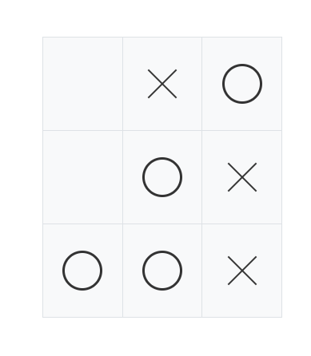

# Tic-Tac-Toe Game

This app is a Tic-Tac-Toe game built using ReactJs. It allows the user to play **against a friend** or **against the computer**.

## How to Play

To play the game, simply click on any of the squares on the board to mark it with your symbol (either X or O). The goal of the game is to get three of your symbols in a row (horizontally, vertically, or diagonally) before your opponent does.

If you are playing against a friend, take turns clicking on the squares to make your moves. If you are playing against the computer, it will automatically make a move after you have made yours.

## Features

This Tic-Tac-Toe game includes the following features:

- [x] The ability to play against a friend or against the computer
- [x] Automatic detection of a win or a tie
- [x] modal that appears when the game is over, showing the winner or announcing a tie
- [x] The option to replay the game after it has ended
- [ ] play with friend in the same room


## Screenshots

### choose Game Mode


### Player O had won



#### showing the winner


### Player X had won


#### showing the winner


### Tie


## Technologies Used

This project was built using the following technologies:

- HTML5
- CSS
- JavaScript(ReactJS)
- Bootstrap

## Getting Started

To get started, clone this repository to your local machine and navigate to the project directory. Then, run the following command to install the necessary dependencies:

```bash
npm install 
```

Once the dependencies have been installed, you can start the development server with the following command:

```bash
npm start 
```

This will start the development server and open the game in your default browser.


## Conclusion

This Tic-Tac-Toe game is a fun and simple project that demonstrates how to use React to build a simple game. Whether you are playing against a friend or against the computer, it is sure to provide hours of entertainment.

## Contributing

We welcome contributions to improve Tic-Tac-Toe game. To contribute, please follow these steps:

1. Fork this repository and clone it to your local machine.
2. Create a new branch for your changes.
3. Make your modifications and commit your changes.
4. Push your changes to your forked repository.
5. Create a pull request from your forked repository to this repository.

Please ensure that your code adheres to our coding standards and passes our tests before submitting a pull request. Additionally, please include a description of your changes and why you think they should be included in the pull request.

Thank you for contributing to Tic-Tac-Toe game!

## Author 

- [:link:](https://github.com/Abdelilah-Falih) <ins>Abdelilah Falih.</ins>
